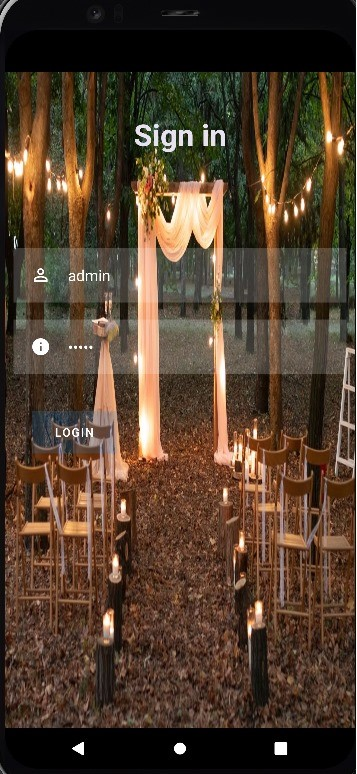
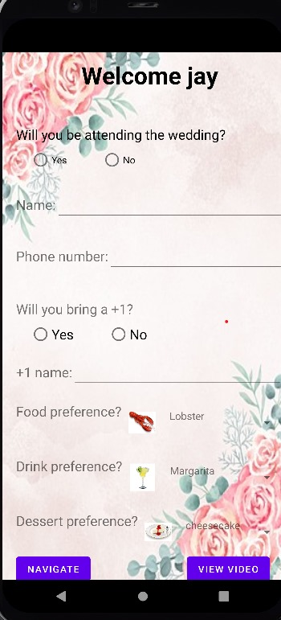

# WeddingPlanner
Wedding Invitation App
The Wedding Invitation App is a mobile application developed using Android Studio, Java, and Firebase Database. This app simplifies the process of sending wedding invitations, collecting guest information, and managing attendance for the groom and bride's special day.

Features
Email Invitations: The groom and bride can send email invitations to their guests using the app. The emails contain a unique username and password for each guest to log in.

Guest Registration: Guests can log in using the provided username and password to access the app. Upon logging in, they are required to fill out a registration form with the following details:

Name of the guest and the accompanying +1 guest
Food preferences (if any)
Drink preferences (if any)
Venue Navigation: The app provides a button that navigates guests to the wedding venue using a maps application.

Attendance Tracking: After submitting the registration form, the guest details are stored in the Firebase Database. The groom and bride, acting as administrators, can view the list of guests who have confirmed their attendance and the details they've filled out.

Dependencies
Firebase Authentication: Manages user authentication.
Firebase Realtime Database: Stores guest information and attendance data.
Google Maps API: Enables venue navigation.

SCREENSHOTS

